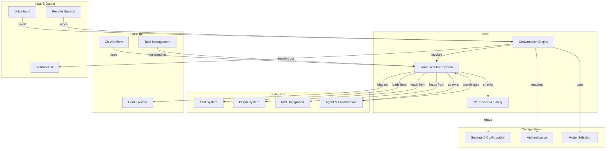

# Product Architecture

## Product Overview

Claude Code is a terminal-based AI coding assistant that combines conversational AI with deep development environment integration. The architecture is organized around a conversation loop where user messages are processed by Claude, which can invoke tools to interact with the local environment, and results are streamed back to the user.

## Business Modules

### Core

Core modules handle the fundamental conversation and interaction loop.

#### Conversation Engine
- **Responsibilities**: Manage multi-turn conversations with Claude, handle message streaming, context window management, and conversation history
- **Features**:
  - Multi-turn conversation with streaming responses
  - Context window optimization and message compaction
  - Conversation history persistence and session resume
  - Plan mode for structured thinking with approval gates
  - Brief mode for condensed interaction style
  - Token estimation and cost tracking
- **Related Models**: Session, Message, ConversationHistory
- **Related Processes**: Conversation Flow, Message Compaction

#### Tool Execution System
- **Responsibilities**: Register, discover, and execute tools that Claude can invoke to interact with the development environment
- **Features**:
  - 40+ built-in tools (file I/O, shell, search, web, etc.)
  - Tool permission checking before execution
  - Streaming tool output with progress indicators
  - Tool search and discovery
  - MCP tool integration
- **Related Models**: Tool, ToolResult
- **Related Processes**: Tool Execution Flow, Permission Check

#### Permission & Safety
- **Responsibilities**: Enforce safety guardrails on tool execution through layered permission rules, dangerous pattern detection, and classifier-based auto-approval
- **Features**:
  - Permission modes (Default, AcceptEdits, Auto, Plan)
  - Per-tool allow/deny/ask rules
  - Dangerous pattern detection (command injection, destructive ops)
  - Classifier-based auto-approval with safety checks
  - Denial tracking and fallback prompting
  - Enterprise policy enforcement
- **Related Models**: PermissionRule, PermissionDecision
- **Related Processes**: Permission Check Flow

### Extension

Modules that extend Claude Code's capabilities beyond built-in tools.

#### Skill System
- **Responsibilities**: Provide a mechanism for users and teams to define custom slash commands that expand into prompts or execute local actions
- **Features**:
  - Bundled skills (shipped with CLI)
  - Filesystem skills (.claude/skills/ directory)
  - Plugin-provided skills
  - MCP-converted skills
  - Inline and forked execution modes
- **Related Models**: Skill
- **Related Processes**: Skill Invocation

#### Plugin System
- **Responsibilities**: Enable third-party extensions to add tools, commands, and capabilities
- **Features**:
  - Plugin manifest and versioning
  - Plugin loading and lifecycle management
  - Plugin-provided tools and commands
- **Related Models**: Plugin
- **Related Processes**: Plugin Loading

#### MCP Integration
- **Responsibilities**: Connect to external tool servers via the Model Context Protocol, enabling dynamic tool and resource discovery
- **Features**:
  - MCP server connection management
  - Dynamic tool discovery from servers
  - Resource listing and reading
  - OAuth authentication for MCP servers
  - Per-server allowlist/denylist
- **Related Models**: MCPServer, MCPResource
- **Related Processes**: MCP Server Connection

#### Agent & Collaboration
- **Responsibilities**: Orchestrate multi-agent workflows including sub-agents, teammate agents, and coordinator-worker patterns
- **Features**:
  - Sub-agent spawning with separate budgets
  - Teammate agents (persistent, task-assignable)
  - Coordinator mode for multi-worker orchestration
  - Agent swarm initialization
  - Inter-agent messaging
- **Related Models**: Agent, Team
- **Related Processes**: Agent Spawning, Coordinator Workflow

### Configuration

Modules managing user preferences, settings, and authentication.

#### Settings & Configuration
- **Responsibilities**: Manage multi-layered settings from user, project, local, flag, and policy sources with proper merging and override semantics
- **Features**:
  - Global user settings (~/.claude/settings.json)
  - Project settings (.claude/settings.json)
  - Local gitignored settings (.claude/local-settings.json)
  - Enterprise managed settings (MDM / remote API)
  - CLAUDE.md project instructions
  - Keybinding customization
  - Theme management
- **Related Models**: Settings
- **Related Processes**: Settings Resolution

#### Authentication
- **Responsibilities**: Handle user identity, API key management, OAuth flows, and subscription verification
- **Features**:
  - API key authentication
  - OAuth (Claude.ai, GitHub, Slack, Google)
  - macOS Keychain integration
  - AWS STS identity verification
  - Subscription tier detection
- **Related Models**: AuthToken
- **Related Processes**: Authentication Flow

#### Model Selection
- **Responsibilities**: Resolve the active Claude model based on session overrides, startup flags, environment variables, and user settings
- **Features**:
  - Model switching (/model command)
  - Model aliases and parsing
  - 1M context variants
  - Pricing information display
- **Related Models**: ModelConfig
- **Related Processes**: Model Resolution

### DevOps

Modules supporting development operations and workflow automation.

#### Git Workflow
- **Responsibilities**: Integrate with git for status tracking, commit creation, branch management, and PR workflows
- **Features**:
  - Git status and branch information
  - AI-assisted commit message generation
  - End-to-end commit-push-PR workflow
  - Code review (/review, /ultrareview)
  - Security review (/security-review)
- **Related Models**: (uses git directly)
- **Related Processes**: Commit Flow, PR Creation, Code Review

#### Task Management
- **Responsibilities**: Provide built-in task/todo tracking for organizing work within conversations
- **Features**:
  - Task creation, update, and status tracking
  - Task dependencies (blocks/blockedBy)
  - Task list display with progress indicators
  - Scheduled tasks (cron-triggered)
- **Related Models**: Task
- **Related Processes**: Task Lifecycle

#### Hook System
- **Responsibilities**: Enable deterministic automation by executing user-defined shell commands in response to tool events
- **Features**:
  - Pre/post tool use hooks
  - User prompt submit hooks
  - File change hooks
  - HTTP webhook hooks
- **Related Models**: Hook
- **Related Processes**: Hook Execution

### Input & Output

Modules handling user input and output rendering.

#### Terminal UI
- **Responsibilities**: Render the conversational interface in the terminal using React/Ink, handling input, output formatting, and interactive elements
- **Features**:
  - Streaming markdown rendering
  - Syntax-highlighted code blocks
  - Interactive permission dialogs
  - Progress spinners and status indicators
  - Virtual scrolling for large outputs
  - Vim keybinding support
- **Related Models**: (UI components)
- **Related Processes**: (rendering pipeline)

#### Voice Input
- **Responsibilities**: Capture audio input and convert speech to text for hands-free interaction
- **Features**:
  - Push-to-talk recording
  - Streaming speech-to-text
  - Audio level visualization
  - Keyword detection
- **Related Models**: (audio state)
- **Related Processes**: Voice Input Flow

#### Remote Session
- **Responsibilities**: Sync CLI sessions with the claude.ai web interface for cross-device access
- **Features**:
  - WebSocket-based session sync
  - Remote permission request handling
  - Bridge mode connection management
  - Trusted device tokens
- **Related Models**: RemoteSession
- **Related Processes**: Remote Session Sync

## Business Module Relationship Diagram

