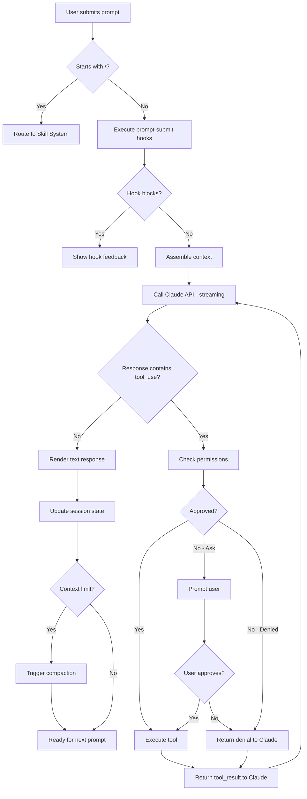

# Conversation Flow

## Overview

Describes the end-to-end flow of a single conversation turn: from the user submitting a prompt through Claude processing, tool invocations, and response rendering. This is the fundamental interaction loop in Claude Code.

## Participating Roles

| Role | Responsibilities |
|------|------------------|
| End User | Submits prompts, approves/denies permissions, reviews responses |
| Claude Assistant | Processes prompts, generates responses, selects and invokes tools |
| Hook Executor | Executes user-prompt-submit hooks before processing |

## Process Steps

### Step 1: User Prompt Submission
- **Executing Role**: End User
- **Description**: The user types a message in the terminal input and submits it
- **Input**: User text (may include file references, images, or slash commands)
- **Output**: Raw user prompt
- **Model State Changes**: None

### Step 2: Prompt Pre-processing
- **Executing Role**: System (Hook Executor)
- **Description**: Execute user-prompt-submit hooks and process any slash commands. If the prompt starts with `/`, route to the skill system instead of the conversation engine.
- **Input**: Raw user prompt
- **Output**: Processed prompt (potentially modified by hooks) or skill invocation
- **Model State Changes**: None

### Step 3: Context Assembly
- **Executing Role**: System
- **Description**: Assemble the full context for the API call: system prompt, CLAUDE.md instructions, git status, available tools, conversation history, and the new user message
- **Input**: Processed prompt, session state
- **Output**: Complete API request payload
- **Model State Changes**: Session.state → processing

### Step 4: API Call & Streaming
- **Executing Role**: Claude Assistant
- **Description**: Send the request to the Claude API and stream the response. Claude may respond with text, tool use requests, or both.
- **Input**: API request payload
- **Output**: Streaming response (text blocks and/or tool_use blocks)
- **Model State Changes**: Message created (role: assistant)

### Step 5: Tool Execution Loop
- **Executing Role**: Claude Assistant + System
- **Description**: For each tool_use block in the response: (a) evaluate permissions, (b) execute the tool if approved, (c) collect the result. Continue streaming if Claude has more to say after seeing results.
- **Input**: tool_use blocks from Claude's response
- **Output**: tool_result blocks injected into conversation
- **Model State Changes**: Tool results added to messages; file system may be modified

### Step 6: Response Rendering
- **Executing Role**: System
- **Description**: Render the complete assistant response in the terminal: markdown formatting, syntax-highlighted code blocks, diff views, and progress indicators
- **Input**: Complete assistant response with tool results
- **Output**: Formatted terminal output
- **Model State Changes**: Session.state → active; token usage and cost updated

### Step 7: Post-Turn Processing
- **Executing Role**: System
- **Description**: Update session state: token counts, cost estimates, task progress. Check if context window is approaching limits (trigger compaction if needed). Extract memories if applicable.
- **Input**: Completed turn data
- **Output**: Updated session state
- **Model State Changes**: Session token/cost attributes updated

## Business Rules

| Rule ID | Rule Name | Rule Description | Applicable Scenario |
|---------|-----------|------------------|---------------------|
| CF-001 | Slash Command Routing | Prompts starting with `/` are routed to the skill system, not sent to Claude | Step 2 |
| CF-002 | Hook Blocking | If a user-prompt-submit hook returns a block decision, the prompt is not processed | Step 2 |
| CF-003 | Streaming Cancellation | User can cancel a streaming response with Escape or Ctrl-C at any time | Steps 4-5 |
| CF-004 | Tool Loop Limit | Maximum number of consecutive tool invocations per turn is enforced to prevent runaway | Step 5 |
| CF-005 | Context Window Guard | If token usage exceeds threshold, compaction is triggered before next turn | Step 7 |
| CF-006 | Cost Tracking | Every API call updates the cumulative token and cost counters | Step 7 |

## Exception Handling

- **API Rate Limit**: Display rate limit message with wait time; auto-retry after cooldown
- **API Error**: Display error to user; session remains active for retry
- **Tool Execution Error**: Return error as tool_result; Claude sees the error and can adjust
- **Permission Denied**: Return denial as tool_result; Claude receives feedback and may choose an alternative approach
- **Context Window Exceeded**: Trigger compaction automatically; if compaction fails, ask user to start a new session

## Flowchart

