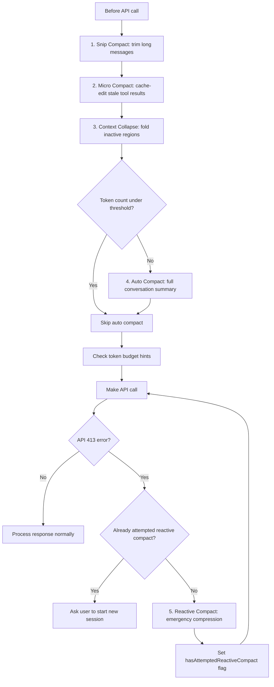

# Context Compression (Four-Stage Mechanism)

## Overview

Claude Code implements a sophisticated four-stage compression pipeline that progressively reduces context size before each API call. The stages are not mutually exclusive — they execute in priority order from lightweight to heavyweight. If lightweight stages compress enough to stay under the token threshold, heavyweight stages are skipped entirely. Additionally, a reactive compact mechanism handles API 413 errors as a last-resort safety net.

A separate Token Budget system allows users to set output token goals, with the system tracking progress and nudging the model to continue working.

## Participating Roles

| Role | Responsibilities |
|------|------------------|
| System | Detects thresholds, executes compression stages, manages token budget |
| Claude Assistant | Generates summaries for context collapse and auto compact |

## Process Steps

### Step 1: Snip Compact
- **Executing Role**: System
- **Description**: Trim excessively long individual messages in the history. This is the lightest-weight compression — it doesn't remove messages, just cuts overly long content within them.
- **Input**: Message list with individual message token counts
- **Output**: Messages with long content truncated
- **Model State Changes**: Message content shortened in-place

### Step 2: Micro Compact
- **Executing Role**: System
- **Description**: Fine-grained compression based on tool_use_id. Identify tool result blocks that are no longer relevant (e.g., old search results, superseded file reads) and cache-edit them — replace content with a summary reference while preserving the conversation structure.
- **Input**: Message list with tool use/result pairs
- **Output**: Stale tool results replaced with compact references
- **Model State Changes**: Tool result content replaced

### Step 3: Context Collapse
- **Executing Role**: System + Claude Assistant
- **Description**: Collapse inactive context regions into summaries. Identify blocks of older conversation that are no longer actively referenced and fold them into a concise summary, preserving key decisions and file changes.
- **Input**: Message list, activity tracking
- **Output**: Inactive regions replaced with summary blocks
- **Model State Changes**: Multiple messages replaced with summary message

### Step 4: Auto Compact
- **Executing Role**: System + Claude Assistant
- **Description**: When total token count approaches the model's context window limit, trigger a full conversation summary. This is the heaviest compression — it generates a comprehensive summary of the entire conversation history and replaces old messages.
- **Input**: Full message list, token threshold
- **Output**: Compressed message list with summary
- **Model State Changes**: Session.state → compacting → active; messages list rebuilt

### Step 5: Reactive Compact (Safety Net)
- **Executing Role**: System
- **Description**: If all four proactive stages fail to keep context under the limit and the API returns a 413 (prompt too long) error, immediately trigger an emergency compression and retry. A hasAttemptedReactiveCompact flag ensures this only happens once per turn to prevent infinite loops.
- **Input**: API 413 error
- **Output**: Emergency compressed context; retry API call
- **Model State Changes**: Messages compressed; flag set to prevent re-entry

### Step 6: Token Budget Tracking
- **Executing Role**: System
- **Description**: When a user specifies an output token budget (e.g., "+500k"), the system tracks cumulative output tokens across turns. As the model approaches the budget target, nudge messages are injected to encourage the model to continue working rather than stopping prematurely.
- **Input**: Token budget target, cumulative output tokens
- **Output**: Nudge messages when approaching budget
- **Model State Changes**: Budget tracking state updated

## Business Rules

| Rule ID | Rule Name | Rule Description | Applicable Scenario |
|---------|-----------|------------------|---------------------|
| CC-001 | Progressive Compression | Execute stages in order from lightweight to heavyweight; skip heavy stages if light ones suffice | Steps 1-4 |
| CC-002 | Recent Message Protection | The most recent N messages are never compressed in any stage | Steps 1-4 |
| CC-003 | System Prompt Preservation | System prompt and CLAUDE.md context are never compressed | Steps 1-4 |
| CC-004 | Active Tool Chain Protection | Messages with pending tool results are not compressed | Steps 2-4 |
| CC-005 | Reactive Compact Once | Reactive compact (API 413 handler) executes at most once per turn | Step 5 |
| CC-006 | Token Budget Nudging | When approaching budget target, inject messages encouraging model to continue | Step 6 |
| CC-007 | Tool Result Budget | Individual tool results that are too large are persisted to disk, with only a summary kept in context | Steps 1-2 |
| CC-008 | MCP Instruction Efficiency | MCP server instructions are only injected for currently-connected servers — disconnected servers don't consume context | All |
| CC-009 | Skill Lazy Injection | Skills are injected into context only when matched, not preloaded at startup | All |
| CC-010 | Memory Prefetch | Memory content is prefetched during model output streaming, overlapping I/O with generation | All |

## Exception Handling

- **All stages fail + API 413**: Trigger reactive compact; if that also fails, ask user to start a new session
- **Summary generation fails**: Keep original messages; warn that context is nearly full
- **Token budget exhausted**: Inform model and user; session can continue without budget tracking

## Flowchart

