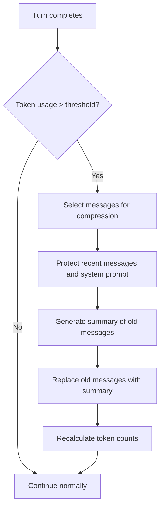

# Message Compaction

## Overview

When a conversation approaches the context window limit, message compaction automatically compresses older messages to free up space while preserving essential context. This allows long-running sessions to continue without losing critical information.

## Participating Roles

| Role | Responsibilities |
|------|------------------|
| System | Detects context limit, triggers compaction, manages compressed history |
| Claude Assistant | Generates summary of compressed messages |

## Process Steps

### Step 1: Threshold Detection
- **Executing Role**: System
- **Description**: After each conversation turn, check if cumulative token usage is approaching the context window limit for the current model
- **Input**: Current token count, model context window size
- **Output**: Compaction trigger decision
- **Model State Changes**: None

### Step 2: Message Selection
- **Executing Role**: System
- **Description**: Select older messages for compression. Keep the system prompt, recent messages, and any messages with active tool use chains intact. Select the oldest non-essential messages for summarization.
- **Input**: Full message list, recency thresholds
- **Output**: Messages to compress vs. messages to retain
- **Model State Changes**: None

### Step 3: Summary Generation
- **Executing Role**: Claude Assistant
- **Description**: Generate a concise summary of the selected messages, capturing key decisions, file changes, and context that may be needed for future turns
- **Input**: Messages selected for compression
- **Output**: Summary text
- **Model State Changes**: Session.state → compacting

### Step 4: History Replacement
- **Executing Role**: System
- **Description**: Replace the compressed messages with a single system message containing the summary. Update token counts.
- **Input**: Summary text, original message list
- **Output**: Compressed message list
- **Model State Changes**: Session.state → active; messages list updated; tokenUsage recalculated

## Business Rules

| Rule ID | Rule Name | Rule Description | Applicable Scenario |
|---------|-----------|------------------|---------------------|
| MC-001 | Recent Message Protection | The most recent N messages are never compressed | Step 2 |
| MC-002 | System Prompt Preservation | System prompt and CLAUDE.md context are never compressed | Step 2 |
| MC-003 | Active Tool Chain Protection | Messages with pending tool results are not compressed | Step 2 |
| MC-004 | Summary Quality | Summary must capture file modifications, key decisions, and unresolved tasks | Step 3 |

## Exception Handling

- **Compaction fails**: Alert user that context is full; suggest starting a new session
- **Summary too large**: Iteratively compress the summary itself

## Flowchart

