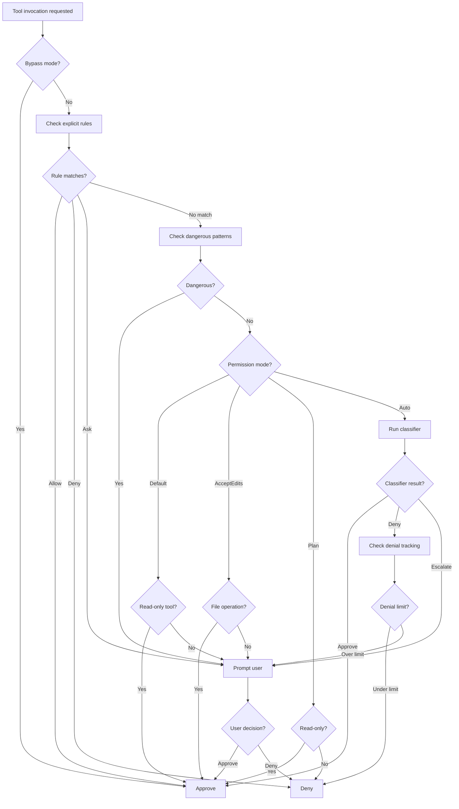

# Permission Check

## Overview

Evaluates whether a specific tool invocation is allowed based on the current permission mode, configured rules, dangerous pattern detection, and classifier-based analysis. This is the central safety mechanism in Claude Code.

The permission system is part of a **three-layer safety net** architecture where each layer serves a distinct role and no layer can bypass another:

1. **Speculative Classifier** (Layer 1 — pre-judgment): BashTool risk classifier runs in parallel with hooks, providing early risk assessment. Its result is advisory only — it informs but cannot override the other layers.
2. **Hook Policy Layer** (Layer 2 — policy enforcement): PreToolUse hooks can return allow/deny/ask decisions. However, **Hook allow cannot bypass settings deny** — this is enforced by resolveHookPermissionDecision().
3. **Permission Decision** (Layer 3 — final authority): Combines rule configuration, classifier results, hook outcomes, and user interaction for the final decision.

This "powerful but controlled" design means even if a hook has a bug or is maliciously exploited, it cannot silently approve a settings-denied operation.

## Participating Roles

| Role | Responsibilities |
|------|------------------|
| System | Evaluates rules, runs classifiers, tracks denials |
| End User | Responds to permission prompts when asked |
| Enterprise Administrator | Defines policy-level rules (indirectly, via managed settings) |

## Process Steps

### Step 1: Bypass Mode Check
- **Executing Role**: System
- **Description**: If the current permission mode is "bypass", immediately approve the tool invocation without further checks.
- **Input**: Current permission mode
- **Output**: Approval (if bypass) or continue to next step
- **Model State Changes**: None

### Step 2: Explicit Rule Matching
- **Executing Role**: System
- **Description**: Check all configured permission rules (from all settings sources) for a match. Rules are checked in priority order: policy > flag > local > project > user. First matching rule wins.
- **Input**: Tool name, parameters, configured rules
- **Output**: Rule match (allow/deny/ask) or no match
- **Model State Changes**: None

### Step 3: Dangerous Pattern Detection
- **Executing Role**: System
- **Description**: For shell execution tools (Bash, PowerShell), scan the command for dangerous patterns: code injection (eval, exec), destructive operations (rm -rf, dd), pipe chains to dangerous commands, etc.
- **Input**: Tool name, command string
- **Output**: Dangerous pattern detected (true/false), pattern details
- **Model State Changes**: None

### Step 4: Permission Mode Evaluation
- **Executing Role**: System
- **Description**: Apply the current permission mode's rules: Default mode prompts for write/execute operations; AcceptEdits auto-approves file operations; Plan mode blocks all write operations; Auto mode uses the classifier.
- **Input**: Permission mode, tool properties (isReadOnly, category)
- **Output**: Mode-based decision
- **Model State Changes**: None

### Step 5: Classifier Evaluation (Auto Mode Only)
- **Executing Role**: System
- **Description**: In Auto mode, run the bash classifier and/or transcript classifier to evaluate the safety of the tool invocation based on context and patterns.
- **Input**: Tool invocation context, conversation transcript
- **Output**: Classifier decision (approve/deny/escalate)
- **Model State Changes**: None

### Step 6: Denial Tracking
- **Executing Role**: System
- **Description**: Track consecutive denials. If the same type of operation has been denied too many times, fall back to prompting the user instead of auto-denying.
- **Input**: Denial history, current denial count
- **Output**: Final decision (allow/deny/ask)
- **Model State Changes**: Denial counter updated

### Step 7: User Prompt (if Ask)
- **Executing Role**: End User
- **Description**: Display an interactive permission dialog showing the tool name, parameters, and reason for the prompt. User can approve, deny, or add a permanent rule.
- **Input**: Tool invocation details, reason for asking
- **Output**: User decision (approve/deny), optional new rule
- **Model State Changes**: Permission rule may be added to session

## Business Rules

| Rule ID | Rule Name | Rule Description | Applicable Scenario |
|---------|-----------|------------------|---------------------|
| PC-001 | Policy Override | Policy-level rules cannot be overridden by any other source | Step 2 |
| PC-002 | Dangerous Pattern Escalation | Dangerous patterns always escalate to user prompt, even in auto mode | Step 3 |
| PC-003 | Read-Only Safe | Read-only tools (Glob, Grep, FileRead) are always allowed in default mode | Step 4 |
| PC-004 | Plan Mode Restriction | In plan mode, only read-only and search tools are allowed | Step 4 |
| PC-005 | Auto Mode Safety | Auto mode cannot approve wildcard bash permissions | Step 5 |
| PC-006 | Denial Limit | After N consecutive auto-denials, fall back to user prompting | Step 6 |

## Exception Handling

- **No rules match and no mode applies**: Default to asking the user
- **Classifier error**: Fall back to rule-based evaluation
- **User prompt timeout**: Treat as denial for this invocation

## Flowchart

