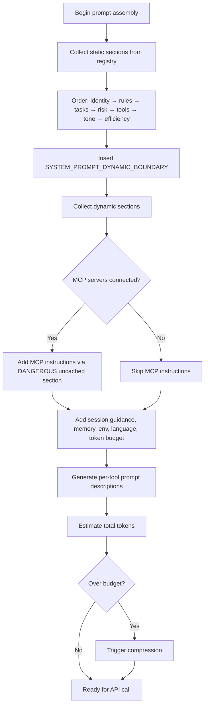

# Prompt Assembly

## Overview

Describes how the system prompt is assembled before each API call. The prompt is built from static (cacheable) and dynamic (per-turn) sections, with careful ordering to maximize API-level prompt cache hit rates. This is a critical performance and cost optimization — cache hits can reduce latency and cost by skipping re-processing of the static prefix.

## Participating Roles

| Role | Responsibilities |
|------|------------------|
| System | Assembles sections, manages section registry, inserts boundary marker |
| MCP Server | Provides instruction sections for injection |
| Plugin | May contribute additional prompt sections |

## Process Steps

### Step 1: Assemble Static Sections
- **Executing Role**: System
- **Description**: Collect all static (cacheable) sections in fixed order: identity → system rules → task behavior → risk actions → tool syntax → tone/style → output efficiency. These sections are created via systemPromptSection() and cached in a section registry until /clear or /compact.
- **Input**: Registered static sections
- **Output**: Static prompt prefix
- **Model State Changes**: None

### Step 2: Insert Dynamic Boundary
- **Executing Role**: System
- **Description**: Insert the SYSTEM_PROMPT_DYNAMIC_BOUNDARY marker. Everything before this marker must remain byte-identical across requests to enable prompt caching.
- **Input**: Static prefix
- **Output**: Static prefix + boundary marker
- **Model State Changes**: None

### Step 3: Assemble Dynamic Sections
- **Executing Role**: System
- **Description**: Collect per-turn dynamic sections: session guidance, CLAUDE.md memory, environment info, language prefs, MCP server instructions, function result clearing notes, token budget hints. MCP instructions use DANGEROUS_uncachedSystemPromptSection() since servers may connect/disconnect between turns.
- **Input**: Session state, connected MCP servers, active tools
- **Output**: Dynamic prompt suffix
- **Model State Changes**: None

### Step 4: Assemble Tool Prompts
- **Executing Role**: System
- **Description**: Each tool generates its own prompt description via its prompt() method. These descriptions are dynamically generated based on the current available tool set and permission mode, ensuring the model sees accurate, contextual tool descriptions.
- **Input**: Registered tools, permission mode
- **Output**: Tool definition array for API call
- **Model State Changes**: None

### Step 5: Token Budget Check
- **Executing Role**: System
- **Description**: Estimate the total token count of the assembled prompt. If approaching the context window limit, trigger compression mechanisms before making the API call.
- **Input**: Assembled prompt, model context window size
- **Output**: Token estimate; compression trigger if needed
- **Model State Changes**: May trigger four-stage compression

## Business Rules

| Rule ID | Rule Name | Rule Description | Applicable Scenario |
|---------|-----------|------------------|---------------------|
| PA-001 | Static Prefix Stability | Never modify content before the dynamic boundary once established — changes break cache for all subsequent requests | Step 1 |
| PA-002 | Section Registry Caching | Sections created via systemPromptSection() are cached until /clear or /compact; only DANGEROUS sections recompute each turn | Step 3 |
| PA-003 | Fork Cache Preservation | When forking sub-agents, inherit parent's system prompt byte-for-byte to maximize prompt cache reuse (do not change model, as it alters the model description field) | Step 1 |
| PA-004 | MCP Instruction Volatility | MCP server instructions must use uncached sections since servers may connect/disconnect between turns | Step 3 |
| PA-005 | Tool Prompt Dynamism | Tool prompts are generated dynamically per call to reflect current tool availability and permission state | Step 4 |

## Flowchart

