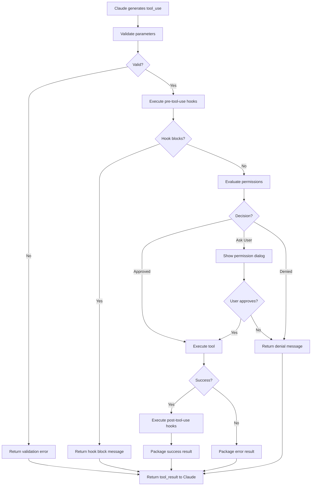

# Tool Execution

## Overview

Describes how Claude invokes a tool and how the system processes the invocation — from Claude's tool_use request through permission checking, execution, hook processing, and result delivery.

## Participating Roles

| Role | Responsibilities |
|------|------------------|
| Claude Assistant | Selects tools and provides invocation parameters |
| System | Validates parameters, routes to tool implementation, manages execution |
| Hook Executor | Runs pre-tool-use and post-tool-use hooks |
| End User | Approves or denies permission requests (when prompted) |

## Process Steps

### Step 1: Tool Selection
- **Executing Role**: Claude Assistant
- **Description**: Based on the conversation context and user request, Claude generates a tool_use content block specifying the tool name and input parameters
- **Input**: Conversation context, available tool list
- **Output**: tool_use block (toolName, toolUseId, input parameters)
- **Model State Changes**: None

### Step 2: Parameter Validation
- **Executing Role**: System
- **Description**: Validate the tool input parameters against the tool's JSON Schema definition. Reject with error if validation fails.
- **Input**: tool_use block, tool parameter schema
- **Output**: Validation result (pass/fail)
- **Model State Changes**: None

### Step 3: Pre-Tool-Use Hook
- **Executing Role**: Hook Executor
- **Description**: Execute any pre-tool-use hooks configured for this tool. Hooks receive tool name and parameters via stdin and can return allow, block, or modify decisions.
- **Input**: Tool name, parameters, hook configuration
- **Output**: Hook decision (allow/block/modify)
- **Model State Changes**: None

### Step 4: Permission Evaluation
- **Executing Role**: System
- **Description**: Evaluate permission rules for this tool invocation (see Permission Check procedure). If denied or requiring user approval, handle accordingly.
- **Input**: Tool name, parameters, permission context
- **Output**: Permission decision
- **Model State Changes**: None

### Step 5: Tool Execution
- **Executing Role**: System
- **Description**: Execute the tool implementation with the validated parameters. Stream output for long-running tools (e.g., bash commands). Enforce timeout limits.
- **Input**: Validated parameters
- **Output**: Tool result (content, isError, duration)
- **Model State Changes**: File system may change (for write/edit/bash tools)

### Step 6: Post-Tool-Use Hook
- **Executing Role**: Hook Executor
- **Description**: Execute any post-tool-use hooks configured for this tool. Hooks receive the tool result and can trigger additional actions (e.g., auto-formatting after file edit).
- **Input**: Tool name, parameters, result
- **Output**: Hook actions (if any)
- **Model State Changes**: File system may change (from hook actions)

### Step 7: Result Delivery
- **Executing Role**: System
- **Description**: Package the tool result as a tool_result content block and inject it into the conversation for Claude to see.
- **Input**: Tool result
- **Output**: tool_result block in conversation
- **Model State Changes**: Message created (tool_result); token usage updated

## Business Rules

| Rule ID | Rule Name | Rule Description | Applicable Scenario |
|---------|-----------|------------------|---------------------|
| TE-001 | Schema Validation | Tool parameters must pass JSON Schema validation before execution | Step 2 |
| TE-002 | Hook Priority | Pre-tool-use hook block decisions take precedence over permission rules | Step 3 |
| TE-003 | Timeout Enforcement | Tools have configurable execution timeouts (default: 2 minutes, max: 10 minutes) | Step 5 |
| TE-004 | Error as Result | Tool execution errors are returned as tool_result with isError=true, not thrown as exceptions | Step 5 |
| TE-005 | Read-Only in Plan Mode | When in plan mode, only read-only tools can execute | Step 4 |
| TE-006 | Rate Limiting | Maximum tool invocations per session is enforced | Step 1 |

## Exception Handling

- **Schema validation failure**: Return error result to Claude with details about what was wrong
- **Hook timeout**: Hook is killed; tool execution proceeds as if hook allowed
- **Tool execution timeout**: Kill the process; return timeout error as tool_result
- **Tool crash**: Catch exception; return error as tool_result
- **Permission denied by user**: Return denial message as tool_result

## Flowchart

