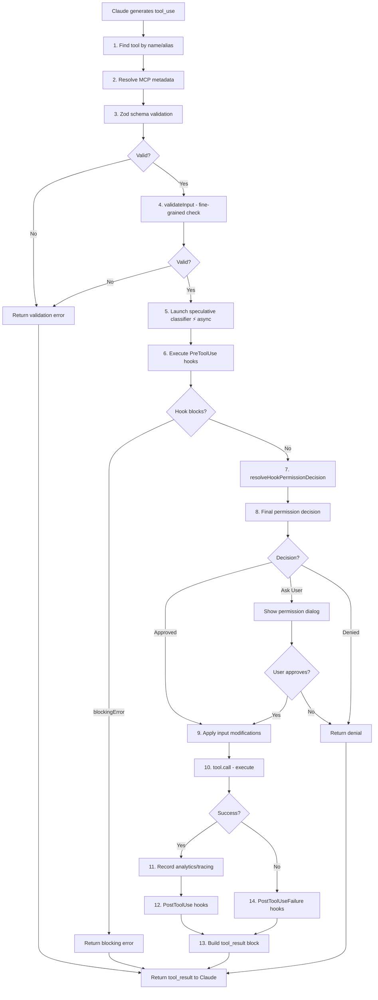

# Tool Execution Pipeline

## Overview

Describes the complete 14-step execution pipeline that processes every tool invocation in Claude Code. This pipeline is implemented in toolExecution.ts (1,745 lines) and represents a core safety and governance mechanism — the model does not simply "call a tool"; every invocation passes through validation, classification, hooks, permission decisions, and tracing.

The pipeline also supports **Streaming Tool Execution**: tools begin executing as soon as their tool_use block is complete in the model's stream, even while the model is still generating subsequent tool_use blocks. This significantly reduces latency for multi-tool turns.

## Participating Roles

| Role | Responsibilities |
|------|------------------|
| Claude Assistant | Selects tools and provides invocation parameters |
| System | Orchestrates the 14-step pipeline |
| Hook Executor | Runs pre/post-tool-use hooks and failure hooks |
| Speculative Classifier | Pre-judges BashTool command risk in parallel |
| End User | Approves or denies permission requests (when prompted) |

## Process Steps

### Step 1: Tool Lookup
- **Executing Role**: System
- **Description**: Find the corresponding Tool object by name or alias. MCP tools may use qualified names (server::tool).
- **Input**: Tool name from tool_use block
- **Output**: Tool object reference
- **Model State Changes**: None

### Step 2: MCP Metadata Resolution
- **Executing Role**: System
- **Description**: If the tool is an MCP tool, extract the originating server information, connection state, and server-specific configuration.
- **Input**: Tool object
- **Output**: MCP server context (if applicable)
- **Model State Changes**: None

### Step 3: Zod Schema Validation
- **Executing Role**: System
- **Description**: Validate the tool input against the tool's Zod inputSchema. This is the first line of defense against malformed parameters.
- **Input**: Raw input parameters, tool inputSchema
- **Output**: Validation result (pass/fail with details)
- **Model State Changes**: None

### Step 4: Fine-Grained Input Validation
- **Executing Role**: System
- **Description**: Execute the tool's own validateInput() method for domain-specific validation beyond schema (e.g., path existence checks, argument range validation, file type verification).
- **Input**: Schema-validated parameters
- **Output**: Validation result (pass/fail with details)
- **Model State Changes**: None

### Step 5: Speculative Classifier (Parallel)
- **Executing Role**: Speculative Classifier
- **Description**: For BashTool specifically, launch an asynchronous risk classifier that analyzes the command's danger level. This runs **in parallel** with hooks (step 6-7), so classification results are ready by the time the permission decision is needed. This "start computing early" pattern reduces user-facing permission dialog latency.
- **Input**: Bash command string, conversation context
- **Output**: Risk classification (runs async, consumed at step 8)
- **Model State Changes**: None

### Step 6: PreToolUse Hooks
- **Executing Role**: Hook Executor
- **Description**: Execute all registered pre-tool-use hooks for this tool. Hooks receive tool name and parameters via stdin and can return:
  - **permissionBehavior** (allow/ask/deny)
  - **updatedInput** (modify the tool's input parameters)
  - **blockingError** (block execution entirely)
  - **preventContinuation** (stop the entire flow after this tool)
  - **additionalContexts** (inject extra context information)
- **Input**: Tool name, parameters, hook configuration
- **Output**: Hook decisions and modifications
- **Model State Changes**: None

### Step 7: Hook Permission Resolution
- **Executing Role**: System
- **Description**: Resolve the hook results into a permission decision using resolveHookPermissionDecision(). Critical rule: **Hook allow cannot bypass settings deny rules**. Specifically:
  - Hook allow + tool requires user interaction + no updatedInput → proceed to normal canUseTool flow
  - Hook allow + settings has deny rule → deny takes precedence
  - Hook allow + settings has ask rule → still prompts user
  - Hook deny → directly deny
  - Hook ask → passed as forceDecision to permission dialog
- **Input**: Hook results, settings rules
- **Output**: Resolved hook permission decision
- **Model State Changes**: None

### Step 8: Permission Decision
- **Executing Role**: System + End User
- **Description**: Combine the speculative classifier result (step 5), hook permission (step 7), configured permission rules, and the current permission mode to make the final allow/deny/ask decision. If "ask", display the interactive permission dialog to the user.
- **Input**: Classifier result, hook decision, permission rules, permission mode
- **Output**: Final permission decision (allow/deny)
- **Model State Changes**: Permission rule may be added if user chooses "always allow/deny"

### Step 9: Input Modification
- **Executing Role**: System
- **Description**: If the permission decision or hooks modified the tool input (e.g., hook returned updatedInput), apply the modifications before execution.
- **Input**: Original input, hook modifications, permission modifications
- **Output**: Final input for execution
- **Model State Changes**: None

### Step 10: Tool Execution
- **Executing Role**: System
- **Description**: Call tool.call() with the final validated, permitted, and potentially modified input. Stream output for long-running tools. Enforce timeout limits.
- **Input**: Final input parameters
- **Output**: Raw tool result
- **Model State Changes**: File system may change (write/edit/bash tools)

### Step 11: Analytics & Tracing
- **Executing Role**: System
- **Description**: Record the tool invocation for analytics, Perfetto tracing, and OpenTelemetry. Call backfillObservableInput() to populate observable fields in the SDK stream and transcript.
- **Input**: Tool name, input, result, duration
- **Output**: Telemetry events emitted
- **Model State Changes**: None

### Step 12: PostToolUse Hooks
- **Executing Role**: Hook Executor
- **Description**: Execute post-tool-use hooks after successful execution. Post-hooks can modify MCP tool output, add messages, and inject additional context.
- **Input**: Tool name, input, result
- **Output**: Hook actions (if any)
- **Model State Changes**: File system may change (from hook actions, e.g., auto-formatting)

### Step 13: Result Processing
- **Executing Role**: System
- **Description**: Package the tool result into a structured tool_result content block. Build the response for injection into the conversation.
- **Input**: Raw tool result
- **Output**: Structured tool_result block
- **Model State Changes**: Message created with tool_result; token usage updated

### Step 14: PostToolUseFailure Hooks
- **Executing Role**: Hook Executor
- **Description**: If the tool execution failed (step 10 errored), execute failure-specific hooks. These run instead of step 12's success hooks.
- **Input**: Tool name, input, error details
- **Output**: Failure hook actions
- **Model State Changes**: None

## Business Rules

| Rule ID | Rule Name | Rule Description | Applicable Scenario |
|---------|-----------|------------------|---------------------|
| TE-001 | Two-Stage Validation | Input passes both Zod schema (step 3) and tool-specific validateInput() (step 4) | Steps 3-4 |
| TE-002 | Speculative Parallelism | BashTool classifier runs in parallel with hooks to pre-compute risk, reducing permission dialog latency | Step 5 |
| TE-003 | Hook Cannot Bypass Deny | Hook returning "allow" cannot override a settings-level "deny" rule — safety layers are non-bypassable | Step 7 |
| TE-004 | Fail-Closed Defaults | Tools that forget to declare safety properties are treated as writable, non-concurrent-safe, and permission-requiring | Steps 3-8 |
| TE-005 | Timeout Enforcement | Tools have configurable execution timeouts (default: 2 minutes, max: 10 minutes) | Step 10 |
| TE-006 | Error as Result | Tool execution errors are returned as tool_result with isError=true, not thrown as exceptions | Step 10 |
| TE-007 | Read-Only in Plan Mode | When in plan mode, only read-only tools can execute | Step 8 |
| TE-008 | Rate Limiting | Maximum tool invocations per session is enforced | Step 1 |
| TE-009 | Streaming Execution | Tools start executing as soon as their tool_use block completes in the stream, overlapping with model's next output | Step 10 |
| TE-010 | Failure vs Success Hooks | PostToolUse hooks run on success; PostToolUseFailure hooks run on failure — they are mutually exclusive | Steps 12, 14 |

## Exception Handling

- **Tool not found**: Return error result to Claude indicating unknown tool
- **Schema validation failure**: Return error result with specific field/type mismatch details
- **Fine-grained validation failure**: Return error result with tool-specific guidance
- **Hook timeout**: Hook is killed; tool execution proceeds as if hook allowed
- **Hook blocking error**: Return blocking error message as tool_result
- **Tool execution timeout**: Kill the process; return timeout error as tool_result
- **Tool crash**: Catch exception; return error as tool_result; trigger PostToolUseFailure hooks
- **Permission denied by user**: Return denial message as tool_result
- **Permission denied by rule**: Return denial message as tool_result

## Flowchart

