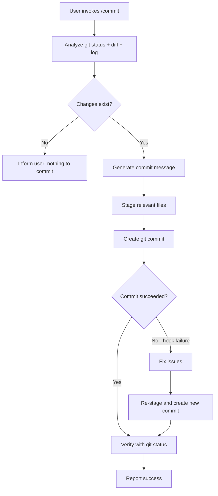

# Commit Flow

## Overview

The `/commit` command enables AI-assisted git commit creation. Claude analyzes staged and unstaged changes, generates a semantically accurate commit message following the repository's conventions, and creates the commit.

## Participating Roles

| Role | Responsibilities |
|------|------------------|
| End User | Invokes /commit, reviews and approves the commit |
| Claude Assistant | Analyzes changes, generates commit message, executes git commands |

## Process Steps

### Step 1: Repository State Analysis
- **Executing Role**: Claude Assistant
- **Description**: Run git status, git diff (staged and unstaged), and git log to understand the current state of changes and the repository's commit message conventions
- **Input**: Current working directory
- **Output**: Change analysis (files modified, change types, recent commit style)
- **Model State Changes**: None

### Step 2: Commit Message Generation
- **Executing Role**: Claude Assistant
- **Description**: Analyze all changes and draft a concise commit message that: (a) summarizes the nature of changes (feature, fix, refactor, etc.), (b) focuses on "why" rather than "what", (c) follows the repository's existing commit message style
- **Input**: Change analysis, git log patterns
- **Output**: Draft commit message
- **Model State Changes**: None

### Step 3: File Staging
- **Executing Role**: Claude Assistant
- **Description**: Stage relevant files using git add. Prefer specific file paths over `git add -A`. Exclude sensitive files (.env, credentials).
- **Input**: Files to stage
- **Output**: Staged files
- **Model State Changes**: Git staging area updated

### Step 4: Commit Creation
- **Executing Role**: Claude Assistant
- **Description**: Execute git commit with the generated message. Include a Co-Authored-By attribution line.
- **Input**: Commit message, staged files
- **Output**: Git commit
- **Model State Changes**: Git history updated

### Step 5: Verification
- **Executing Role**: Claude Assistant
- **Description**: Run git status to verify the commit succeeded. If pre-commit hooks fail, fix the issue and create a new commit (not amend).
- **Input**: Git status
- **Output**: Verification result
- **Model State Changes**: None

## Business Rules

| Rule ID | Rule Name | Rule Description | Applicable Scenario |
|---------|-----------|------------------|---------------------|
| CF-001 | No Sensitive Files | Never commit files that likely contain secrets (.env, credentials.json) | Step 3 |
| CF-002 | Specific Staging | Prefer adding specific files by name rather than git add -A | Step 3 |
| CF-003 | New Commit on Hook Failure | If pre-commit hook fails, fix and create a new commit, never amend | Step 5 |
| CF-004 | Attribution | Include Co-Authored-By line in commit messages | Step 4 |
| CF-005 | Convention Following | Match the repository's existing commit message style | Step 2 |

## Exception Handling

- **No changes to commit**: Inform user, do not create empty commit
- **Pre-commit hook failure**: Fix the issue, re-stage, create a new commit
- **Staging failure**: Report error to user with details

## Flowchart

