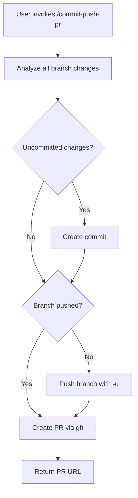

# PR Creation

## Overview

The `/commit-push-pr` command provides an end-to-end workflow for committing changes, pushing to a remote branch, and creating a GitHub pull request with an AI-generated description.

## Participating Roles

| Role | Responsibilities |
|------|------------------|
| End User | Invokes command, reviews PR details |
| Claude Assistant | Analyzes changes, creates commit, pushes branch, creates PR |

## Process Steps

### Step 1: Full Change Analysis
- **Executing Role**: Claude Assistant
- **Description**: Analyze all commits on the current branch since diverging from the base branch. Look at git status, staged/unstaged changes, and the full commit history.
- **Input**: Current branch, base branch
- **Output**: Complete change analysis across all commits
- **Model State Changes**: None

### Step 2: Commit (if needed)
- **Executing Role**: Claude Assistant
- **Description**: If there are uncommitted changes, create a commit following the Commit Flow procedure
- **Input**: Uncommitted changes
- **Output**: New commit (if applicable)
- **Model State Changes**: Git history updated

### Step 3: Branch & Push
- **Executing Role**: Claude Assistant
- **Description**: Create a new branch if needed. Push to remote with the -u flag to set up tracking.
- **Input**: Branch name, remote
- **Output**: Branch pushed to remote
- **Model State Changes**: Remote branch created/updated

### Step 4: PR Creation
- **Executing Role**: Claude Assistant
- **Description**: Create a GitHub PR using `gh pr create` with an AI-generated title (under 70 characters) and body containing: summary bullets, test plan, and attribution.
- **Input**: All commits, change analysis
- **Output**: PR URL
- **Model State Changes**: GitHub PR created

## Business Rules

| Rule ID | Rule Name | Rule Description | Applicable Scenario |
|---------|-----------|------------------|---------------------|
| PR-001 | Title Length | PR title must be under 70 characters | Step 4 |
| PR-002 | All Commits | PR description must reflect ALL commits, not just the latest | Step 4 |
| PR-003 | No Force Push | Never force push unless explicitly asked | Step 3 |
| PR-004 | Summary Format | PR body includes Summary (bullets), Test Plan (checklist), and attribution | Step 4 |

## Exception Handling

- **No remote configured**: Ask user to configure remote
- **Push rejected**: Report conflict; suggest pull/rebase
- **gh CLI not available**: Inform user to install GitHub CLI

## Flowchart

