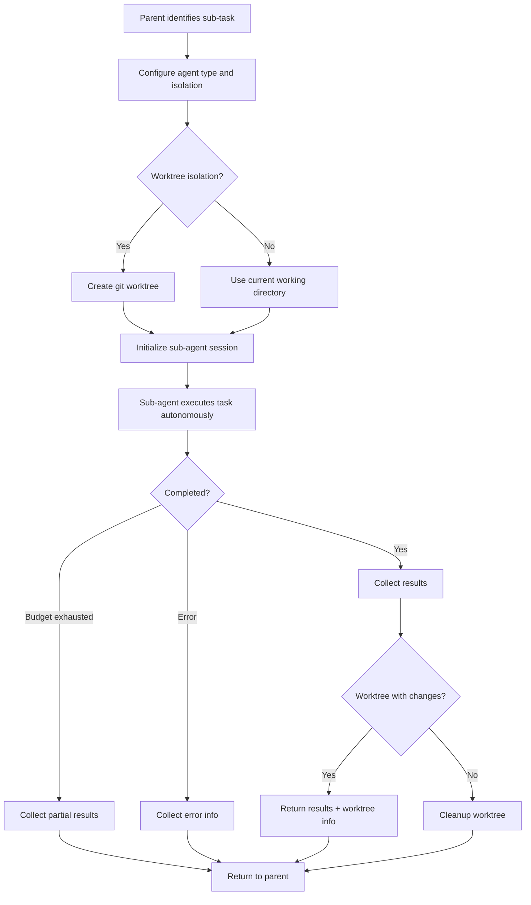

# Agent Spawning

## Overview

Describes how Claude spawns sub-agents to handle complex sub-tasks in isolation. Sub-agents have their own token budgets, can operate in git worktrees for isolation, and return results to the parent agent.

## Participating Roles

| Role | Responsibilities |
|------|------------------|
| Claude Assistant (Parent) | Decides to spawn a sub-agent, provides task description and configuration |
| Sub-Agent | Executes the assigned task autonomously, returns results |
| System | Manages agent lifecycle, token budgets, and worktree isolation |

## Process Steps

### Step 1: Task Analysis
- **Executing Role**: Claude Assistant (Parent)
- **Description**: Determine that a sub-task would benefit from isolated execution — either for parallelization, context isolation, or specialized agent type
- **Input**: Current conversation context, sub-task requirements
- **Output**: Decision to spawn agent with task description
- **Model State Changes**: None

### Step 2: Agent Configuration
- **Executing Role**: Claude Assistant (Parent)
- **Description**: Configure the sub-agent: select agent type (general-purpose, Explore, Plan, etc.), set isolation mode (default or worktree), provide a complete task prompt
- **Input**: Agent type, isolation mode, task prompt
- **Output**: Agent tool invocation with configuration
- **Model State Changes**: None

### Step 3: Agent Initialization
- **Executing Role**: System
- **Description**: Create a new session for the sub-agent with inherited permission rules. If worktree isolation is requested, create a temporary git worktree. Assign a separate token budget.
- **Input**: Agent configuration
- **Output**: Initialized sub-agent session
- **Model State Changes**: New Session created (parentSessionId set)

### Step 4: Autonomous Execution
- **Executing Role**: Sub-Agent
- **Description**: The sub-agent processes its task independently, using available tools. It operates within its own conversation context and token budget.
- **Input**: Task prompt, available tools
- **Output**: Task results
- **Model State Changes**: Sub-agent session messages and tool invocations

### Step 5: Result Return
- **Executing Role**: System
- **Description**: When the sub-agent completes (or exhausts its budget), collect its final output and return it to the parent agent. If a worktree was used and changes were made, return the worktree path and branch.
- **Input**: Sub-agent final output
- **Output**: Result message to parent conversation
- **Model State Changes**: Parent session receives agent result

## Business Rules

| Rule ID | Rule Name | Rule Description | Applicable Scenario |
|---------|-----------|------------------|---------------------|
| AS-001 | Token Budget | Sub-agents have separate token budgets that don't consume the parent's budget | Step 3 |
| AS-002 | Permission Inheritance | Sub-agents inherit the parent session's permission rules | Step 3 |
| AS-003 | Worktree Cleanup | Temporary worktrees are automatically cleaned up if no changes were made | Step 5 |
| AS-004 | Agent Type Restrictions | Different agent types have different tool availability (e.g., Explore agents cannot edit files) | Step 3 |
| AS-005 | Background Execution | Agents can run in background; parent is notified on completion | Step 4 |

## Exception Handling

- **Agent budget exhausted**: Return partial results with a note about budget exhaustion
- **Agent error**: Return error message to parent; parent can retry or take alternative approach
- **Worktree conflict**: Report conflict to parent agent for resolution

## Flowchart

