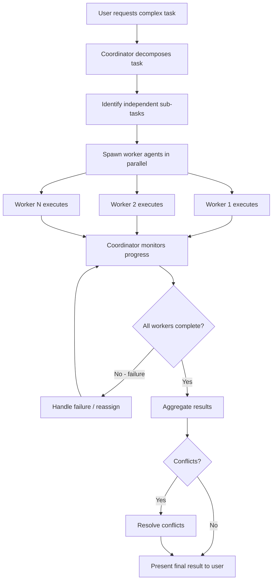

# Coordinator Workflow

## Overview

The Coordinator Workflow enables a specialized Claude instance to orchestrate multiple worker agents in parallel, distributing tasks across workers and aggregating results. This is used for complex tasks that benefit from parallel execution.

## Participating Roles

| Role | Responsibilities |
|------|------------------|
| End User | Initiates the coordinated task |
| Coordinator | Breaks down the task, spawns workers, aggregates results |
| Worker Agents | Execute individual sub-tasks and report back |
| System | Manages worker lifecycle and shared scratchpad |

## Process Steps

### Step 1: Task Decomposition
- **Executing Role**: Coordinator
- **Description**: Analyze the user's request and decompose it into parallelizable sub-tasks. Identify dependencies between tasks.
- **Input**: User request
- **Output**: List of sub-tasks with dependency graph
- **Model State Changes**: None

### Step 2: Worker Spawning
- **Executing Role**: Coordinator
- **Description**: Spawn worker agents for independent sub-tasks. Each worker receives a complete task description with relevant context from the scratchpad.
- **Input**: Sub-task descriptions
- **Output**: Running worker agents
- **Model State Changes**: Worker sessions created

### Step 3: Parallel Execution
- **Executing Role**: Worker Agents
- **Description**: Workers execute their assigned tasks concurrently. They can write to the shared scratchpad directory for cross-worker knowledge sharing.
- **Input**: Sub-task prompt, available tools
- **Output**: Individual task results
- **Model State Changes**: Files may be created/modified; scratchpad updated

### Step 4: Progress Monitoring
- **Executing Role**: Coordinator
- **Description**: Monitor worker progress. Send follow-up messages to workers via SendMessage if needed. Handle worker failures or budget exhaustion.
- **Input**: Worker status updates
- **Output**: Coordination decisions
- **Model State Changes**: None

### Step 5: Result Aggregation
- **Executing Role**: Coordinator
- **Description**: Collect results from all workers, resolve any conflicts, and synthesize a cohesive final output for the user.
- **Input**: All worker results
- **Output**: Aggregated result
- **Model State Changes**: Coordinator session updated with final output

## Business Rules

| Rule ID | Rule Name | Rule Description | Applicable Scenario |
|---------|-----------|------------------|---------------------|
| CW-001 | Independent Tasks | Workers should receive tasks that can execute independently without blocking each other | Step 1 |
| CW-002 | Scratchpad Sharing | Workers share a common scratchpad directory for durable cross-worker knowledge | Step 3 |
| CW-003 | Conflict Resolution | When workers modify the same files, the coordinator must resolve conflicts | Step 5 |
| CW-004 | Failure Isolation | One worker's failure should not prevent other workers from completing | Step 4 |

## Exception Handling

- **Worker failure**: Coordinator notes the failure, may reassign the task to a new worker
- **All workers fail**: Report failure to user with details from each worker
- **Merge conflicts**: Coordinator resolves conflicts or asks user for guidance

## Flowchart

